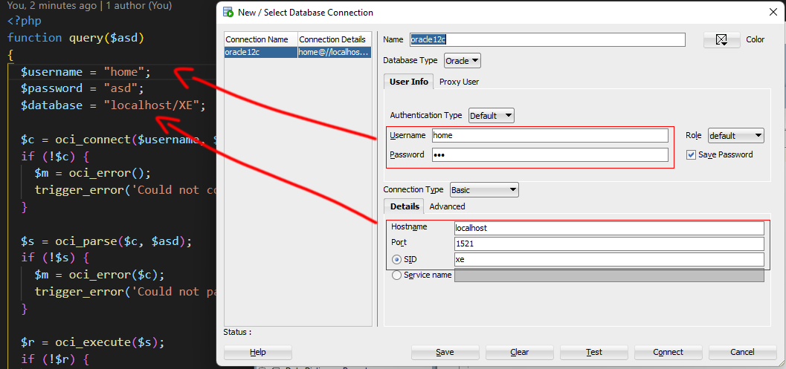

# Tudásadatbázis

Adatbázis alapú rendszerek kötelező feladat. :)

# Csapattagok

Nagy György (MRK2F9)

Vajda Tibor (PC6HVE)

Dobi Krisztina (JXAFFF)

# Feladat

A témánk a tudásadatbázis lett. A tudásadatbázis egy olyan adatbázis, amelybe egy
regisztráció után, a bejelentkezett felhasználó cikkeket tud feltölteni. Egy lektor (admin)
ellenőrzi a tartalmakat mielőtt azok megjelennének a nyilvánosság előtt. Lehetőség van a
feltöltött cikkek olvasására, böngészésére is, melyhez nem szükséges a regisztráció sem.
Témakörök, altémakörök és kulcsszavak alapján is lehet keresni a cikkeket.

# Csatlakozási segédlet

### php/functions/query.php
 

